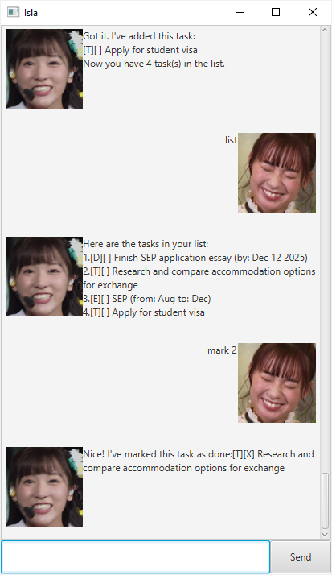

# Isla User Guide

Welcome to Isla, your personal task management assistant.
Inspired by the anime Plastic Memories, Isla is designed to help you efficiently manage your tasks with a simple and intuitive command-line interface.
Whether you need to keep track of deadlines, schedule events, or organize your to-do list, Isla is here to assist you every step of the way.

* Table of Contents
  {:toc}

--------------------------------------------------------------------------------------------------------------------

## Quick start

1. Ensure you have Java `17` or above installed on your computer.

2. Download the latest `.jar` file from [here](https://github.com/kokseen1/ip/releases).

3. Copy the file to the folder you want to use as the _home folder_ for your Isla chatbot.

4. Open a command terminal, `cd` into the folder you put the jar file in, and use the `java -jar isla.jar` command to run the application.

5. Type a command in the command box and press Enter to execute it. For example, typing **`help`** and pressing Enter will display the help message.

6. Refer to the [Features](#features) section below for details on each command.

--------------------------------------------------------------------------------------------------------------------

## Features

* Words in `UPPER_CASE` are the parameters to be supplied by the user. 
  e.g., in `todo DESCRIPTION`, `DESCRIPTION` is a parameter that can be replaced with an actual task description.

* Items in square brackets are optional. 
  e.g., `deadline DESCRIPTION /by DATE` requires a description and a deadline date.

* The command syntax must be followed strictly. Extra spaces or incorrect formats may result in errors.

--------------------------------------------------------------------------------------------------------------------

### Viewing help : `help`

Displays a list of available commands and their usage.

Format: `help`

### Listing all tasks : `list`

Displays all tasks in the task list.

Format: `list`

### Adding a Todo task : `todo`

Creates a new to-do task with a description.

Format: `todo DESCRIPTION`

Example:
* `todo Buy groceries`

### Adding a Deadline task : `deadline`

Creates a new deadline task with a description and a due date.

Format: `deadline DESCRIPTION /by YYYY-MM-DD`

Example:
* `deadline Submit assignment /by 2025-03-10`

### Adding an Event task : `event`

Creates a new event task with a description, start date, and end date.

Format: `event DESCRIPTION /from YYYY-MM-DD /to YYYY-MM-DD`

Example:
* `event Team meeting /from 2025-03-01 /to 2025-03-02`

### Marking a task as completed : `mark`

Marks the specified task as completed.

Format: `mark TASK_NUMBER`

Example:
* `mark 2` (marks task number 2 as completed)

### Unmarking a task : `unmark`

Marks the specified task as not completed.

Format: `unmark TASK_NUMBER`

Example:
* `unmark 2` (marks task number 2 as not completed)

### Searching for tasks : `find`

Finds and lists tasks that contain the specified keyword in their descriptions.

Format: `find KEYWORD`

Example:
* `find meeting` (displays all tasks containing the word "meeting")

### Exiting the application : `bye`

Closes the Isla chatbot.

Format: `bye`

--------------------------------------------------------------------------------------------------------------------

## Command summary

| Action                           | Format, Examples                                                                                               |
|----------------------------------|----------------------------------------------------------------------------------------------------------------|
| **List tasks**                   | `list`                                                                                                         |
| **Show help**                    | `help`                                                                                                         |
| **Add a To-do**                  | `todo DESCRIPTION`  e.g., `todo Read book`                                                                  |
| **Add a Deadline**               | `deadline DESCRIPTION /by YYYY-MM-DD`  e.g., `deadline Finish project /by 2025-04-01`                       |
| **Add an Event**                 | `event DESCRIPTION /from YYYY-MM-DD /to YYYY-MM-DD`  e.g., `event Workshop /from 2025-05-10 /to 2025-05-12` |
| **Mark task as completed**       | `mark TASK_NUMBER`  e.g., `mark 3`                                                                          |
| **Unmark task as not completed** | `unmark TASK_NUMBER`  e.g., `unmark 3`                                                                      |
| **Find tasks by keyword**        | `find KEYWORD`  e.g., `find homework`                                                                       |
| **Exit application**             | `bye`                                                                                                          |
